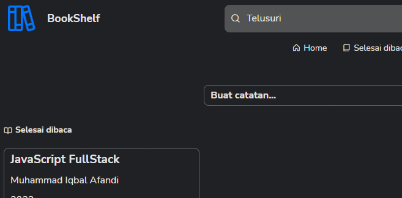
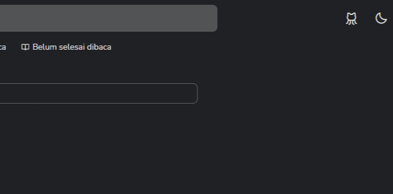
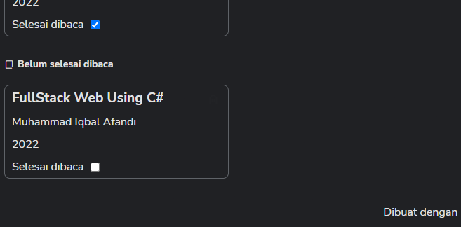
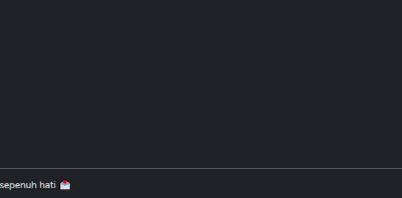
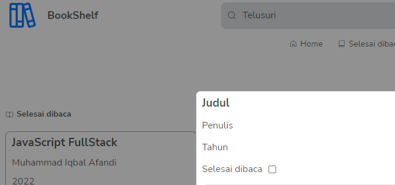
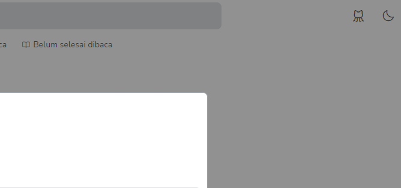
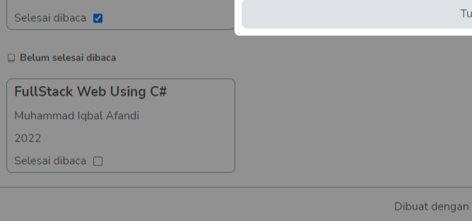

# BookShelf

BookShelf is a simple frontend web app for managing personal reading notes. Users can add books, mark them as finished or unfinished, search by title or author, switch theme mode, edit existing data, and delete records. The app runs entirely in the browser and stores its data in `localStorage`, so no backend server or external database is required.

## Preview

<p align="center">
  
  <br>
  
  
</p>

<p align="center">
  
  <br>
  
  
</p>

## Features

- Add a new book note
- Edit an existing book
- Delete a book with confirmation dialog
- Mark a book as finished or unfinished
- Search books by title or author
- Filter views: all books, finished books, unfinished books
- Toggle dark and light theme
- Persist data locally in the browser with `localStorage`

## Architecture Overview

This project uses a small modular frontend architecture based on vanilla JavaScript classes:

- `App` is the main orchestrator. It wires views, storage, settings, and user interactions together.
- `View` classes manage DOM rendering and DOM events for a specific UI area.
- `BookStore` acts as a lightweight data layer for reading and writing book data from `localStorage`.
- `Form` handles collecting, filling, and clearing form values.
- CSS is split into global styles, variables, and layout-specific files.

Application flow:

1. `index.html` loads `src/scripts/index.js`.
2. `index.js` creates an `App` instance.
3. `App` initializes views, loads theme settings, renders books, and registers event handlers.
4. User actions trigger handlers in `App`.
5. `App` updates data through `BookStore`, then re-renders the UI.

## Folder and File Structure

```text
bookshelf/
├── index.html
├── README.md
└── src/
    ├── docs/
    │   └── images/
    ├── images/
    │   ├── favicon.ico
    │   └── web-logo.png
    ├── scripts/
    │   ├── App.js
    │   ├── Form.js
    │   ├── config.js
    │   ├── index.js
    │   ├── store/
    │   │   └── BookStore.js
    │   └── views/
    │       ├── BookView.js
    │       ├── DialogView.js
    │       ├── EditorView.js
    │       └── NavbarView.js
    └── styles/
        ├── global.css
        ├── index.css
        ├── variable.css
        └── layouts/
            ├── book.css
            ├── dialog.css
            ├── footer.css
            └── navbar.css
```

### Main files

- `index.html`: main HTML shell, app layout, stylesheet import, font import, icon script, and entry script.
- `src/scripts/index.js`: JavaScript entry point that bootstraps the app.
- `src/scripts/App.js`: central controller for rendering, searching, filtering, editing, deleting, saving, and theme settings.
- `src/scripts/Form.js`: reads values from the editor form and writes values back when editing.
- `src/scripts/config.js`: stores local storage keys and default app settings.
- `src/scripts/store/BookStore.js`: local data access layer for CRUD operations.
- `src/scripts/views/*.js`: UI-specific modules for books, editor, navbar, and confirmation dialog.
- `src/styles/index.css`: root stylesheet that imports the rest of the CSS files.
- `src/styles/variable.css`: CSS custom properties for theme colors, spacing, radius, and transitions.
- `src/styles/global.css`: reset and shared utility classes.
- `src/styles/layouts/*.css`: layout-level styling for major UI sections.

## File Naming Convention Used in This Repo

The project currently uses a practical mixed naming convention:

- `PascalCase` for JavaScript classes and files that export classes:
  - `App.js`
  - `Form.js`
  - `BookStore.js`
  - `BookView.js`
  - `EditorView.js`
  - `NavbarView.js`
  - `DialogView.js`
- `lowercase` for entry/config files and CSS files:
  - `index.js`
  - `config.js`
  - `index.css`
  - `global.css`
  - `navbar.css`

Why it works:

- Class-based modules are easy to identify because their filenames match the exported class name.
- Style and configuration files remain simple and descriptive with lowercase names.

Recommended rule if continuing this codebase:

- Use `PascalCase` for files that export a class.
- Use `lowercase` for config, entry, asset, and stylesheet files.
- Keep feature files grouped by responsibility, for example `views/`, `store/`, and `styles/layouts/`.

## API Explanation

This app does not use a remote API and does not have a backend API endpoint.

Instead, it uses:

- Browser DOM API for rendering and interaction
- Browser `localStorage` API for persistence
- Event listeners for application behavior

### Internal module API

Even though there is no HTTP API, the app does expose a small internal API through its JavaScript classes.

#### `BookStore`

`BookStore` provides CRUD-like methods over browser storage:

- `books()`: returns all books from `localStorage`, sorted by newest first
- `save(book)`: saves a new book
- `show(id)`: returns one book by `id`
- `edit(id, book)`: updates a book or toggles its `isComplete` status
- `delete(id)`: removes a book by `id`

#### `Form`

- `getForm()`: collects current form values and returns a book object
- `setForm(book)`: fills the form for editing
- `clearForm()`: resets the form after saving

#### View modules

- `BookView`: renders book cards and binds click events for show, toggle, and delete actions
- `EditorView`: opens and closes the editor panel and triggers save on close
- `NavbarView`: handles mobile menu, theme toggle, search, and navigation filter
- `DialogView`: renders and controls the confirmation dialog

## Database Schema

This app does not use MySQL, PostgreSQL, MongoDB, Prisma, or another server database. Its data is stored in browser `localStorage`.

### Storage keys

- `books`: stores the list of all book records
- `theme`: stores application settings, currently theme mode

### Book schema

Each book item saved in `localStorage` has the following shape:

```json
{
  "id": 1712345678901,
  "title": "Clean Code",
  "author": "Robert C. Martin",
  "year": "2008",
  "isComplete": true
}
```

### Type description

```js
{
  id: number,
  title: string,
  author: string,
  year: string,
  isComplete: boolean
}
```

### Theme settings schema

```json
{
  "darkTheme": true
}
```

### Notes about persistence

- `id` is generated with `+new Date()` when a new book is created.
- Data is saved only in the user browser.
- Clearing browser storage will remove app data.
- Data is not shared across devices or browsers.

## Technology Stack

This project is built with:

- HTML5
- CSS3
- Vanilla JavaScript with ES Modules
- Browser `localStorage` for persistence

### Libraries and external resources used

- [Phosphor Icons](https://phosphoricons.com/) via CDN for iconography
- [Google Fonts - Nunito Sans](https://fonts.google.com/specimen/Nunito+Sans) via CDN for typography

## Setup Project

Because this is a static frontend project, setup is very small.

### Prerequisites

- A modern browser such as Chrome, Edge, Firefox, or Brave
- A local static server

### Clone the project

```bash
git clone https://github.com/MuhammadIqbalAfandi/bookshelf.git
cd bookshelf
```

## How to Run the App

Because the app uses JavaScript modules, it should be served through a local HTTP server instead of opening `index.html` directly from the file system.

### Option 1: Run with VS Code Live Server

If you use VS Code:

1. Install the Live Server extension.
2. Right-click `index.html`.
3. Choose `Open with Live Server`.

### Option 2: Any static server

You can use any static file server you prefer, for example:

```bash
npx serve .
```

## How to Use the App

1. Open the editor area labeled `Buat catatan...`.
2. Fill in the title, author, year, and reading status.
3. Close the editor to save the data.
4. Use the search bar to filter by title or author.
5. Use navigation to switch between all books, finished books, and unfinished books.
6. Click a book card to edit it.
7. Click the trash button to delete it.
8. Use the moon icon to toggle theme mode.

## How to Test the App

At the moment, this repository does not contain automated unit tests, integration tests, or end-to-end tests.

### Current testing approach

Testing is manual in the browser.

Recommended manual test checklist:

1. Open the app in a browser.
2. Add a new book and verify it appears in the correct section.
3. Add a book with `Selesai dibaca` checked and confirm it appears in the finished list.
4. Search by title and author and verify the results are filtered correctly.
5. Click a book card, edit the values, and confirm changes are saved.
6. Toggle the checkbox on a book card and verify the book moves between sections.
7. Delete a book and confirm the dialog works and the data is removed.
8. Refresh the page and confirm the book data still exists.
9. Toggle the theme and refresh the page to confirm theme persistence.
10. Test on desktop and mobile screen widths.

### Suggested future testing improvements

- Add unit tests for `BookStore`
- Add UI behavior tests for form interactions
- Add end-to-end tests with Playwright or Cypress
- Add linting and formatting checks

## Current Limitations

- Data is stored only in browser `localStorage`
- No user authentication
- No sync between devices
- No backend API
- No automated tests
- No package-based development workflow yet

## Summary

BookShelf is a lightweight browser-based bookshelf app built with plain HTML, CSS, and JavaScript. It uses a modular class-based structure, stores book data in `localStorage`, and can be run with any simple static server. The project is a good fit for learning DOM manipulation, modular frontend structure, and browser-side persistence without backend complexity.
